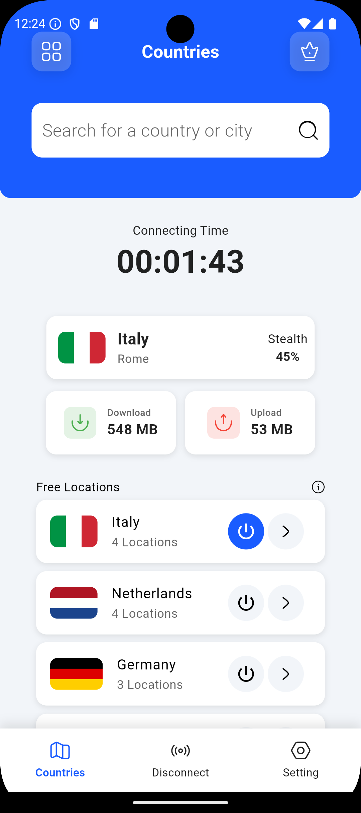

# VPN App

Flutter ile geliştirilmiş, çok katmanlı mimariye sahip, study case amaçlı bir VPN uygulaması.

## Özellikler

- Ülke listesi ve ülke arama
- Mock verilerle bağlantı/bağlantı kesme simülasyonu
- Bağlantı istatistikleri (hız, süre, vb.)
- Modern ve animasyonlu kullanıcı arayüzü


## Kurulum

### Gereksinimler

- Flutter SDK (>=3.4.3 <4.0.0)
- Gerekli platform araçları (Android Studio, Xcode, vs.)

### Adımlar

1. **Projeyi Klonlayın**
   ```sh
   git clone https://github.com/bilalcavus/VpnApp.git
   cd vpn_app
   ```

2. **Bağımlılıkları Yükleyin**
   ```sh
   flutter pub get
   ```

3. **Projeyi Çalıştırın**
   - Android/iOS:
     ```sh
     flutter run
     ```
   - Web:
     ```sh
     flutter run -d chrome
     ```
   - Masaüstü (Windows/Mac/Linux):
     ```sh
     flutter run -d windows
     ```

## Kullanım

- Uygulama açıldığında ülke listesi görüntülenir ve bir ülkeye bağlanmanız beklenir.
- Bağlantı sağlandıktan sonra bağlantı ülkesi ve istatistikleri görüntülenir.
- Arama çubuğu ile ülke/şehir arayabilirsiniz.
- Bir ülkeye tıklayarak bağlantı simülasyonu başlatılır.
- Bağlantı ve bağlantı kesme işlemleri mock verilerle simüle edilir.

## Proje Mimarisi

```
lib/
  core/         # Temel yardımcılar, tema, DI
  data/         # Mock veri kaynakları, modeller
  domain/       # Entity, repository, use case
  presentation/ # View, ViewModel (MVVM), widget
  assets/       # Bayraklar, animasyonlar
```

- **Katmanlı mimari** (Clean Architecture yaklaşımı)
- **MVVM (Model-View-ViewModel) mimarisi:** Sunum katmanında View ve ViewModel ayrımı ile reaktif yapı
- **Dependency Injection:** get_it
- **State Management & Navigation:** GetX
- **Mock veri kaynakları:** Backend bağımsız geliştirme

## Kullanılan Paketler

| Paket                        | Amaç / Kullanım Nedeni                                      |
|------------------------------|-------------------------------------------------------------|
| flutter                      | Flutter SDK, temel framework                                |
| cupertino_icons              | iOS tarzı ikonlar                                           |
| get                          | State management, navigation ve reaktif yapı için           |
| hugeicons                    | Zengin ikon seti                                            |
| get_it                       | Dependency injection (bağımlılık yönetimi)                  |
| equatable                    | Model karşılaştırmalarında kolaylık                         |
| lottie                       | Animasyon gösterimi için                                    |
| shared_preferences           | Lokal veri tutma (seçilen temayı tutmak için kullanılıyor)  |
| json_annotation              | JSON serileştirme işlemleri için                            |
| flutter_test                 | Flutter test                                                |
| leak_tracker                 | Bellek sızıntısı tespiti                                    |
| build_runner                 | Kod üretimi ve otomasyon                                    |
| json_serializable            | JSON serileştirme için kod üretimi (g.dart modelleri için)  |

## Not
- Proje study case amaçlıdır.
  

## Görüntüler
<p align="left">
  
  
  
  
  
  
  
  
</p>
